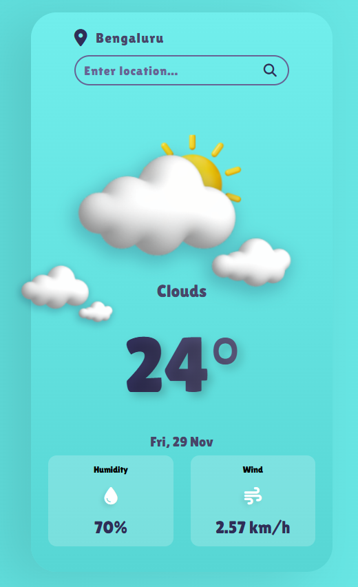

# Weather App

A simple weather app built with React.js and the OpenWeatherMap API.

## Features

- Displays the current weather for a default city.
- Allows users to search for weather details of any city.
- Responsive design for desktop and mobile.

## Tech Stack

- React.js

## Demo



## Installation

1. Clone the repository:
   ```bash
   https://github.com/Jaya-Krishna-07/weather-app.git
   cd weather-app

2. Install dependencies:
   ```bash
   npm install

3. Create a .env file in the root directory and add your OpenWeatherMap API key
   ```bash
   VITE_OPEN_WEATHER_MAP_API_KEY=your_api_key_here

4. Start the development server:
   ```bash
   npm run dev
   
5. Open the app in your browser at 
   ```bash 
   http://localhost:5173

## Usage
1. The app will display the weather for a default city (e.g., Bengaluru) when loaded.
2. Use the search bar to find weather details for any city by entering its name.

## API Reference
- OpenWeatherMap API: [https://openweathermap.org/api](https://openweathermap.org/api)